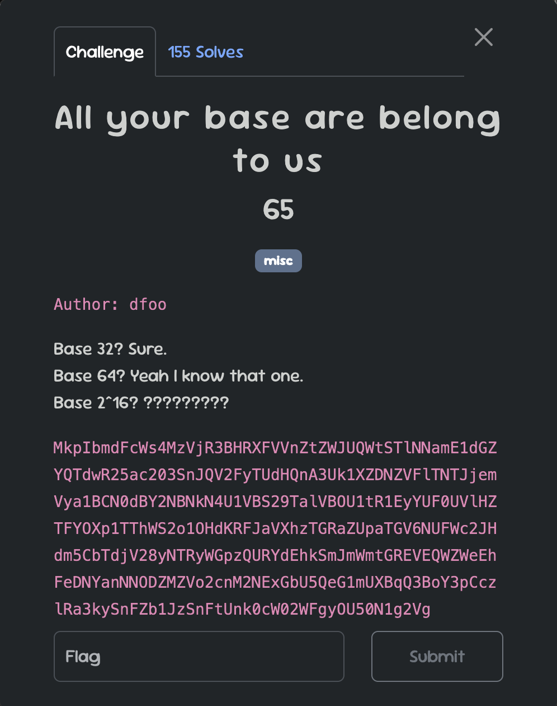
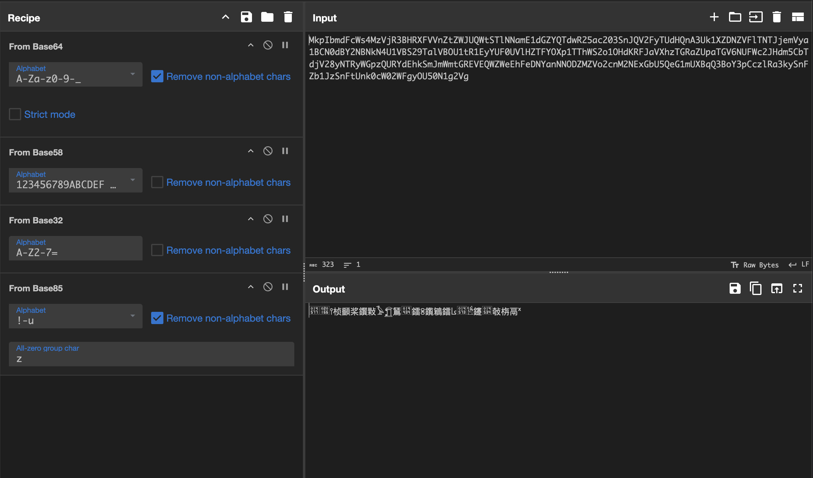
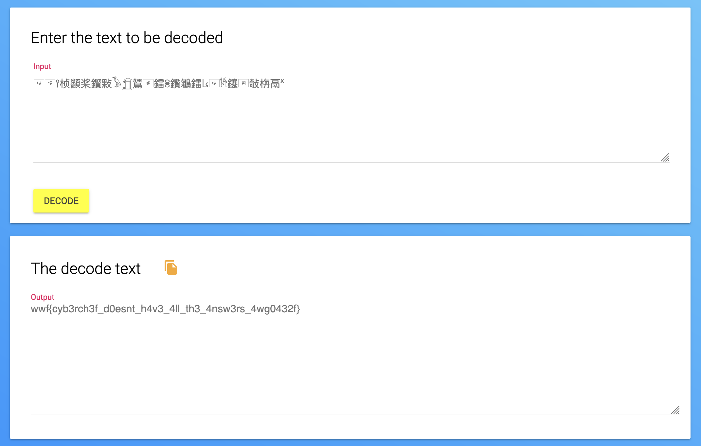

This challenge requires you to decode a sequence of text that has been encoded multiple times using various base encoding schemes. The description and title both hint towards base encodings, and the challenge provides an encoded string that you must decipher.

The sequence of encodings is as follows:

    Base64 → Base58 → Base32 → Base85.

Tools like cyberchef will automatically detect these encodings, making this first part simple.

The last part is a bit trickier becuase cyberchef does not include this base encoding. The clue in the descripton (base 2^16) hints at base65536 encoding. We can find other online tools that that will decode this for us, and get us the flag.

