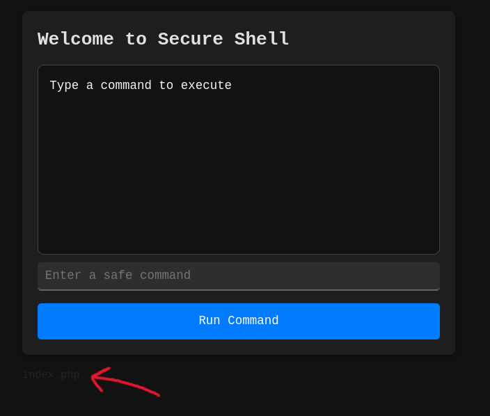
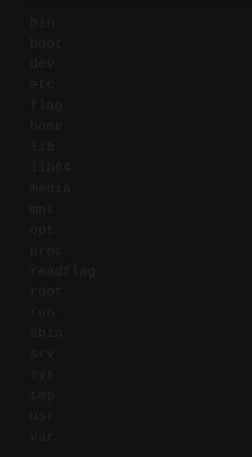
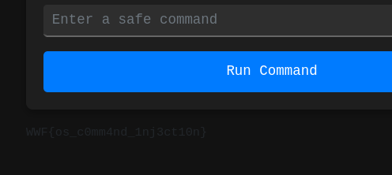

first of all we try to list the directories by doing 
```
ls
```



now lets try to view the / directory
```
ls /
```



we can't read the flag.txt so lets try to execute the readflag using the following payload

```
echo $(/readflag)
```

