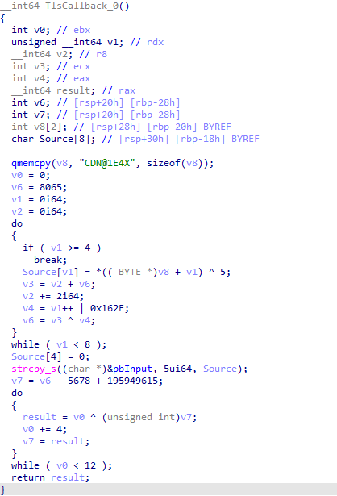
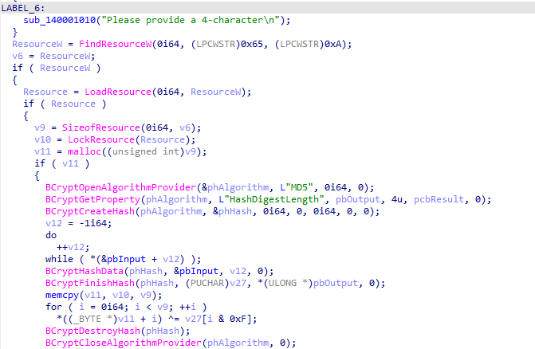
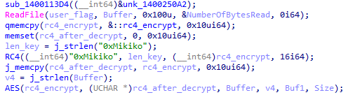
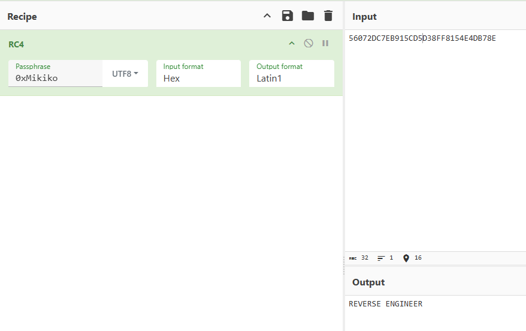
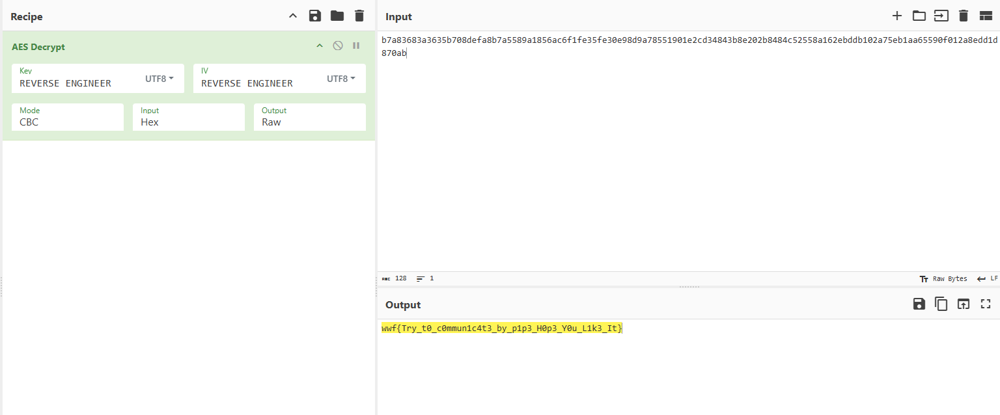

We are given a file `challenge.exe` with the description above. The goal is to identify what function was executed before the main function. Upon opening the file in IDA, we find a **TLS Callback** function. 

After analyzing, the `pbInput` value, once decoded, is the string `"FAKE"`, which is a rabbit hole. Returning to analyze the main function, we observe that it requires the user to input a 4-character string, calculates the MD5 hash of the string, and uses the result to XOR with a resource. By brute-forcing or using other methods, we determine the correct 4-character string to be `"FLAG"`.

If the user enters the correct string `"FLAG"`, the program creates a server pipe to compare the user-provided flag with the server's calculated result.

The program uses **RC4 decryption** to generate a key for **AES encryption**.

The server reads the flag provided by the user through the pipe, encrypts it with the key `"REVERSE ENGINEER"`, and compares it with a byte sequence. If they match, the program outputs `"Success"`. Otherwise, it outputs `"Failure"`.

